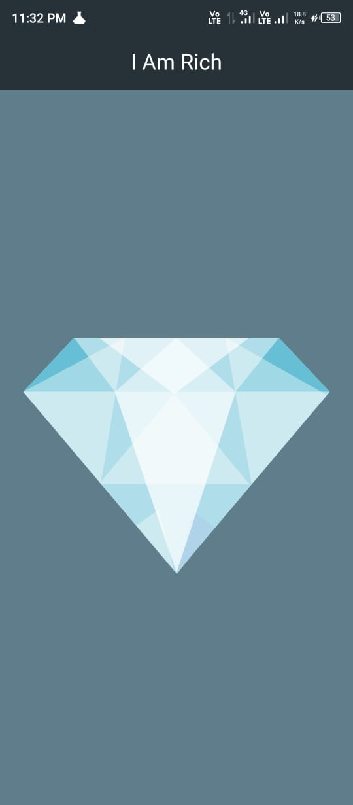

# I Am Rich App

This is a simple Flutter application called "I Am Rich". It is a minimalist app that demonstrates the basics of Flutter app development, focusing on UI design and layout.

## Description

The "I Am Rich" app consists of a single screen that displays an image of a diamond or gem along with the text "I Am Rich". It serves as a fun and educational project for beginners learning Flutter development.

## Features

- Displays a diamond or gem image.
- Displays the text "I Am Rich".

## Screenshots

## Usage

1. Clone or download the repository.
2. Open the project in Android Studio or any other Flutter-compatible IDE.
3. Run the app on an emulator or physical device.

## Contributing

Contributions are welcome! If you find any issues or have suggestions for improvement, feel free to open an issue or submit a pull request.

## License

This project is licensed under the [MIT License](LICENSE).
